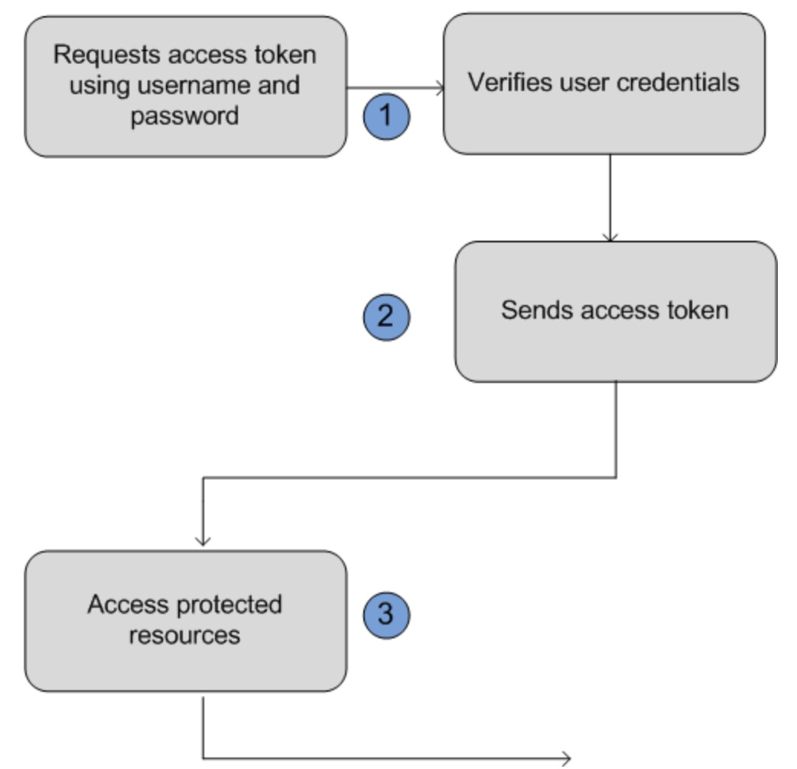

<!--
+++
title = "Digits Authentication Server - REST-API"
draft = false
date = "2018-08-08T08:05:08+01:00"
description = "REST-API documentation of the authentication server"
tags = [ "development", "readme", "authentication", "REST", "api" ]
categories = [ "development", "rest" ]
+++
-->

# DigitS - Authentication: REST-API Documentation #

**Version**: 0.5-beta (29th August 2018)

**Note**:  status in progress (Sprint 1) - still under development

-------------------

## Authentication Methods

There are three ways to authenticate with this API:

* with an **OAuth2 Access Token** in the *Authorization* request header field (which uses the *Bearer* authentication scheme to transmit the Access Token)
* TODO: with your Client ID and Client Secret credentials
* only with your Client ID

#### OAuth2 token

In this case, you have to send a valid Access Token in the Authorization header, using the Bearer authentication scheme. An example is the Get User Info endpoint. In this scenario, you get an Access Token when you authenticate a user, and then you can make a request to the Get User Info endpoint, using that token in the Authorization header, in order to retrieve the user's profile.

#### TODO: Client ID and Client Secret

In this case, you have to send your Client ID and Client Secret information in the request JSON body. An example is the Revoke Refresh Token endpoint. This option is available only for confidential applications (such as applications that are able to hold credentials in a secure way without exposing them to unauthorized parties).

#### TODO: Client ID

For public applications (such as applications that cannot hold credentials securely, like SPAs or mobile apps) we offer some endpoints that can be accessed using only the Client ID. An example is the Implicit Grant.

-------------------

## Security Authentication Workflow

----

### 1: Client Request for JWT-Token (session based security token)
The application uses the user’s username and password to request an access token. This is done via an out-of-band POST request to the appropriate digits token request endpoint, such as `https://[example.digits.de]/api/oauth/token`: 

### **`POST /oauth/token`** (without auth)
	
Parameter (**Body**)  | Type   | Description        
:-----------------|:-------|:-----------------
`client_id`       | Number | Unique API client ID (The Consumer Key from the connected app definition.)   *(currently not checked!)*
`client_secret`   | String | Client secret code (the Consumer Secret from the connected app definition. Required unless the Require Secret for Web Server Flow setting is not enabled in the connected app definition.)   *(currently not checked!)*
`grant_type `	     | String |  Allowed grant types: "`password`" or .... *(further authorization methods will follow!)* 
`username` 	| String |  Only for "`password`" grant type - end user login (email)
`password` 	| String | Only for "`password`" grant type - end-user password
? | ? | (more to follow - depending on further grant types....)

##### Example curl request 
<pre>
curl -X POST
    -u client_id:client_secret
    -d "grant_type=password"
    -d "username=user@digits.de"
    -d "password=xxxxxxx"
    http://{example.digits.com}/api/oauth/token
</pre>
    
##### Example raw request 
<pre>
POST /oauth/token HTTP/1.1
Content-Type: application/x-www-form-urlencoded
client_id=123&client_secret=02468abcdef&username=user%40digits.de&password=xxxxxxx&grant_type=password
</pre>

------

### 2:  Server Rsponse 

**TODO - ont specified finally ... - only use "access_token" !!!**

DigitS Authentication Server verifies the user credentials, and if successful, sends a response to the application with the access token. This response contains the following values:

Parameter         | Description        
:-----------------|:-------------------------
`access_token`      | Access token that acts as a session ID that the application uses for making requests. This token should be protected as though it were user credentials.
`instance_url`      |	Identifies the Salesforce instance to which API calls should be sent.
`id` 	               | Identity URL that can be used to both identify the user as well as query for more information about the user. Can be used in an HTTP request to get more information about the end user.
`issued_at`         | When the signature was created, represented as the number of seconds since the Unix epoch (00:00:00 UTC on 1 January 1970).
`signature`         | Base64-encoded HMAC-SHA256 signature signed with the client_secret (private key) containing the concatenated ID and issued_at value. The signature can be used to verify that the identity URL wasn’t modified because it was sent by the server.

An example response body might look something like:
<pre>	
{"id":"https://login.salesforce.com/id/00Dx0000000BV7z/005x00000012Q9P",
"issued_at":"1278448832702","instance_url":"https://yourInstance.salesforce.com/",
"signature":"0CmxinZir53Yex7nE0TD+zMpvIWYGb/bdJh6XfOH6EQ=","access_token":
"00Dx0000000BV7z!AR8AQAxo9UfVkh8AlV0Gomt9Czx9LjHnSSpwBMmbRcgKFmxOtvxjTrKW1
9ye6PE3Ds1eQz3z8jr3W7_VbWmEu4Q8TVGSTHxs"}
</pre>	

##### Example of successful response

<pre>
HTTP/1.1 200 OK
{
    "access_token": "4df20e702bfaeee96ecd6cbbc4ff384c166f5567",
    "token_type": "bearer",
    "expires_in": 3600,
    "refresh_token": "3901415998eb583aedabd027b93578df25ef93c6",
    "scope": "adverts-write read"
}
</pre>

##### Example of error response

<pre>
HTTP/1.1 400 Bad request
{
    "error": "invalid_grant",
    "error_description": "Invalid client-id credentials parameter",
    "error_human_title": "invalid application",
    "error_human_message": "your application is not registed at digits.co"
}
</pre>

------------

##### 3: All further request data with JWT-Token

The application uses the provided access token to access protected user data.

Use in the **Header**:

<pre>
{
	access-token: "4df20e702bfaeee96ecd6cbbc4ff384c166f5567"
}
</pre>

Note:  the JWT token ("access_token") might be outdated over time - so the application must renew the token... 
** (TODO:  explain how renewal could work)**

---------------------------

### User Administration (w/ auth)

Currently Authorizaton (= user administration) ist **not** supported !

***potential future API could look like this:***

* *TODO*: `GET /authorization/roles` - returns list of all available roles
* *TODO*: `GET /authorization/roles/<userid>` ( user ethereum address)
* *TODO*: `PUT /authorization/roles/<userid>?<roleid>` ( user ethereum address, role id )
* *TODO*: `DEL /authorization/roles/<userid>?<roleid>` ( user ethereum address, role id )

-------

### Standard Return Codes ##

The server API returns a http status code for all restful calls. Depending on the return code the response body may contain a JSON error.

return code  | meaning       | description
:-----------:|:--------------|:--------------------
`200`| OK  |  
`400`| bad request (client error)  | a JSON response body with more error details is returned to the client:  <pre>ResponseBody {     Error : { Code: < Error Number >, Desc: ‘< Error Desc >’ }  }</pre> 
`401`| unauthorized | Authentication failed.  the API request requires a JWT security token (login before)
`403`| forbidden  | security authorization does not contain the necessary security-role (via JWT token)
`404`| not found | requested data is not available
`500`| internal server error  | a JSON response body with more error details is returned to the client: <pre>ResponseBody {     Error : { Code: < Error Number >, Desc: ‘< Error Desc >’ }  }</pre>

----------------

## Dokumentation / Links ##

* [Tutorial Example](https://scotch.io/tutorials/authenticate-a-node-js-api-with-json-web-tokens)
* [api-Oauth2-PostToken](https://www.autovit.ro/api/doc/#api-Oauth2-PostToken)
* [Example API documentation from SalesForce](https://developer.salesforce.com/docs/atlas.en-us.api_rest.meta/api_rest/intro_understanding_username_password_oauth_flow.htm)
* Contact:  [Henner Harnisch](https://github.com/p009922)

----------------
Copyright &copy; 2017 [digit-s.com](digit-s.com)
