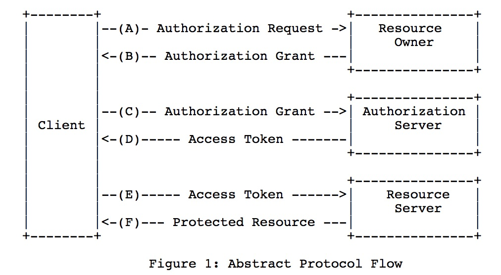

<!--
+++
title = "Digits - Howto Authentication"
draft = false
date = "2018-08-08T08:05:08+01:00"
description = "Howto documentation for best practice of authentication"
tags = [ "development", "readme", "howto", "authentication", "security" ]
categories = [ "development", "howto", "security" ]
+++
-->

# Howto: Authentication (IT-Security)

## Requirements / Acceptance Criteria

* maximum usage of best practices and standards
* keep it simple (simple to use)
* for the implementation of business logic APIs:  "one authentication fits all"
* central authentication solution (one common API)
* plugins to support "legacy" authentication protocolls 
* support for different "authentications" (e.g. face-recognition, smart-card, google-login, civic.com, user/password)
* support for 2FA (2-factor-authentication) via mobile-app (QR-code)
* transparent to use to the user / customer
* might be hosted in the Azure Cloud ...
* concept of bring your own identity (BYOI)
* personal data protection (solution should capsulate personal data)

## Architektur Concept 

### Abstract Concept
The rfc7650 describes the following abstract concept-architecture, which the solution should be based on:

     
The approach:

* "Resource-Server" are the normal application server providing REST-APIs ...
* "Authorization Server" and "Resource Owner" will be the bases for a centralized "Authentication Server" (this paper is about)

 

## API

API of JWT should be standardized.  Good example is [civic.com](https://docs.civic.com/#PROOF_OF_IDENTITYResponseObjects)

(see separate Markdown-Documentation for API ...)

## Use Case Beispiele 
- login with user+password
- login with face-recognition / finger-print via mobile
- saved JWT token:
		+ on smart-card
		+ IOS Container
		+ Microsoft Azure
- login via well accepted third party solutions
 		- civic.com
 		- google-authentication

--> all above examples will after "login" provide the very same JWT-token to access specific applicaton-APIs...

## Examples of Integrations (howto)
 (to be defined)
 
 A mock implementation is done via JavaScript (express-server) - contact: Henner Harnisch.
 
 
-----

## Contact

On questions please contact [Henner Harnisch](https://github.com/p009922) or one of the [main contributors](https://github.com/dapp-dev/digits-server/graphs/contributors).  

## Links

* [rfc7519](https://tools.ietf.org/html/rfc7519)
* [rfc6750]( https://tools.ietf.org/html/rfc6750)
* [Digitalization Bank Concept](https://www.yes.com/)
* [Documentation JWT](https://codeburst.io/jwt-to-authenticate-servers-apis-c6e179aa8c4e)
* [JWT vs. Seccion-Cookies](https://ponyfoo.com/articles/json-web-tokens-vs-session-cookies)
* [Example: auth0](https://auth0.com/docs/jwt)
* [Example: netlify](https://www.netlify.com/blog/2018/01/23/getting-started-with-jwt-and-identity/)
* [Example: civic.com](https://docs.civic.com/#PROOF_OF_IDENTITYResponseObjects)
* [Example with javascript express](https://dev.to/medaymentn/securing-your-node-js-api-with-json-web-token-5o5)
* [Best Practice: JWT](https://stackoverflow.com/questions/33265812/best-http-authorization-header-type-for-jwt)